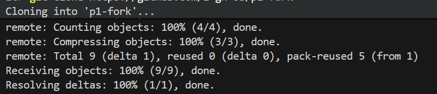
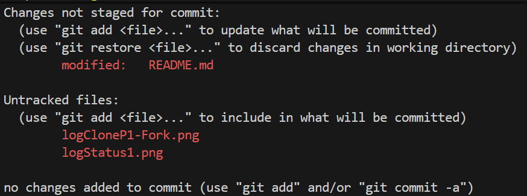
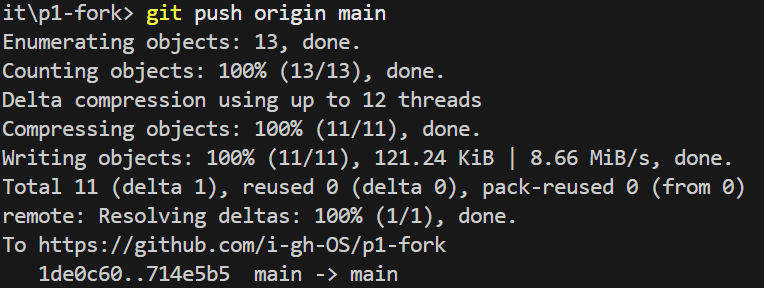
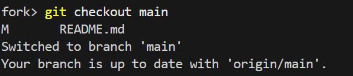

# Práctica 1

**Nombre:** Irene Morales Pérez

**Curso:** 3º GITT+BA 

**Fecha:** 17/01/2026

---

## Git y GitHub

Previamente a la realización de la práctica se ha investigado sobre la funcionalidad y modo de uso de algunos comandos básicos: [Explicación Comandos Básicos Git](git.txt) 

### Pasos en el uso de los comandos
> ℹ️ A continuación se describirá la secuencia de pasos seguidos en la práctica realizada sobre Git y GitHub

1) Creamos un fork de https://github.com/gitt-3-pat/p1 en nuestra cuenta de github. Esto descarga un respositorio copia no vinculado al original.

2) Después clonamos el [repositorio fork de p1](https://github.com/i-gh-OS/p1-fork) en local (o codespace) para trabajar sobre él.
    ``git clone https://github.com/i-gh-OS/p1-fork``.

    Observamos que por la terminal nos sale el siguiente log:

    

3) Miramos el estado actual del repositorio p1-fork usando ``git status``.

    Puesto que no hemos modificado nada, nos sale el siguiente log:

    

4) Mientras se realizaba la practica, se ha ido actualizando la memoria y se han incorporado archivos .png al repositorio. Escribiendo nuevamente el comando ``git status`` observamos el siguiente log que nos indica que hay archivos sin traquear y que el archivo [README.md](https://github.com/i-gh-OS/p1-fork/README.md) sobre el que estamos escribiendo se ha modifcado:

    

5) Seleccionamos estos cambios para que se guarden en el siguiente commit usando el comando ``git add .`` y observamos que el status cambia de nuevo.

    

6) Empaquetamos estos cambios que hemos seleccionado con ``git add`` usando el comando ``git conmmit``.

    

7) Volcamos los commits que tenemos con los cambios al repositorio remoto (origin) para que los cambios aparezcan en nuestro fork en GitHub usando el comando ``git push origin main``. 

    

A medida que vamos modificando desde nuestro ordenador los ficheros del repositorio, iremos repitiendo los pasos 3), 5), 6) y 7) para tener constancia de todo los cambios que hacemos.

8) Si queremos crear otra rama para trabajar en ella sin alterar el *main* usamos el comando ``git checkout -b {nombre rama}``. 

    

    Si ya tenemos otra rama creada y solo queremos movernos a ella basta con usar ``git checkout {nombre rama}``. 

    

#### Resumen comandos git utilizados

```
git clone {dirección repositorio}
git status
git add .
git commit -m "{mensaje}"
git push

git checkout -b {nombre rama}
git checkout main
```
---

## Entorno de desarrollo Java