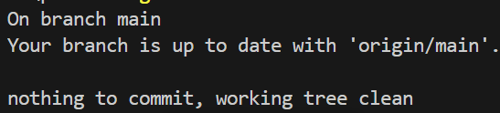
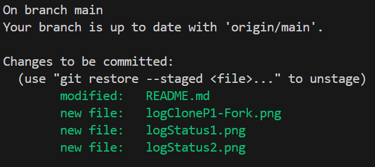
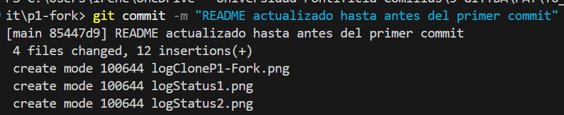

# Práctica 1

**Nombre:** Irene Morales Pérez

**Curso:** 3º GITT+BA 

**Fecha:** 17/01/2026


## Git y GitHub
### Significado comandos
* *git clone:* genera una copia local de un repositorio
* *git status:* 

Un repositorio para empezar a usar [git](https://git-scm.com/) y Github

### Pasos
1) Creamos un fork de https://github.com/gitt-3-pat/p1 en mi cuenta de github. Esto descarga un respositorio copia no vinculado al original.
2) Después clonamos el [repositorio fork de p1](https://github.com/i-gh-OS/p1-fork) en local (o codespace) para trabajar sobre él.
    ``git clone https://github.com/i-gh-OS/p1-fork``
    Observamos que por la terminal nos sale el siguiente log:

    
3) Miramos el estado actual del repositorio p1-fork usando ``git status``
    Puesto que no hemos modificado nada, nos sale el siguiente log:

    
4) Mientras se realizaba la practica, se ha ido actualizando la memoria y se han incorporado dos archivos .png al repositorio. Escribiendo nuevamente el comando ``git status`` observamos el siguiente log que nos indica que hay archivos sin traquear y que el archivo [README.md](https://github.com/i-gh-OS/p1-fork/README.md) sobre el que estamos escribiendo se ha modifcado:

    
5) Seleccionar estos cambios para que se guarden en el siguiente commit usando el comando ``git add`` y observamos que el status cambia de nuevo.

    
6) Por último empaquetamos estos cambios que hemos seleccionado con ``git add`` usando el comando ``git conmmit``.

    

7) Volcamos los commits que tenemos con los cambios al repositorio remoto (origin) para que los cambios aparezcan el nuestro fork en GitHub usando el comando ``git push origin main``. 

    

A medida que vamos modificando desde nuestro ordenador los ficheros del repositorio, iremos repitiendo los pasos 3), 5) y 6) creando commits pequeños para traquear todo los cambios que hacemos.

## ¿Como probar en la nube?

[Github-Codespaces](https://github.com/features/codespaces)

## Comandos git básicos

```
git clone https://github.com/gitt-3-pat/p1
git status
git add .
git commit -m "TU MENSAJE"
git push

git checkout -b feature/1
git checkout main
```

## ¿Cómo escribir un README.md con formato?

[Github Markdown](https://docs.github.com/es/get-started/writing-on-github/getting-started-with-writing-and-formatting-on-github/basic-writing-and-formatting-syntax)
